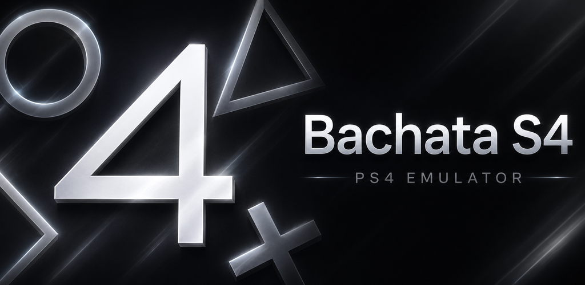
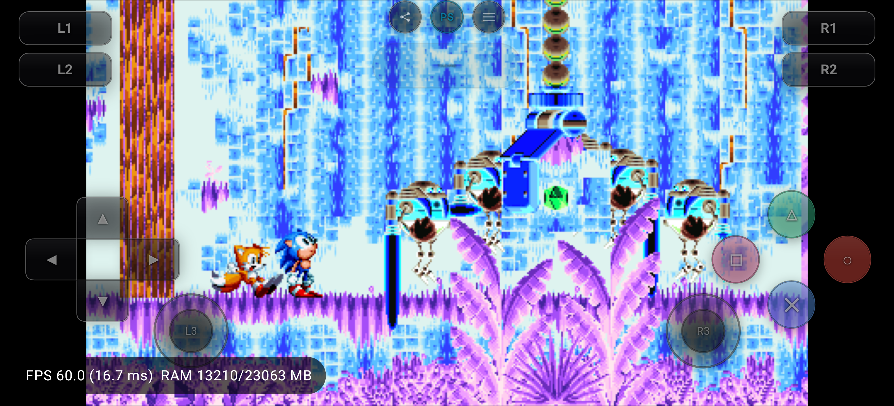
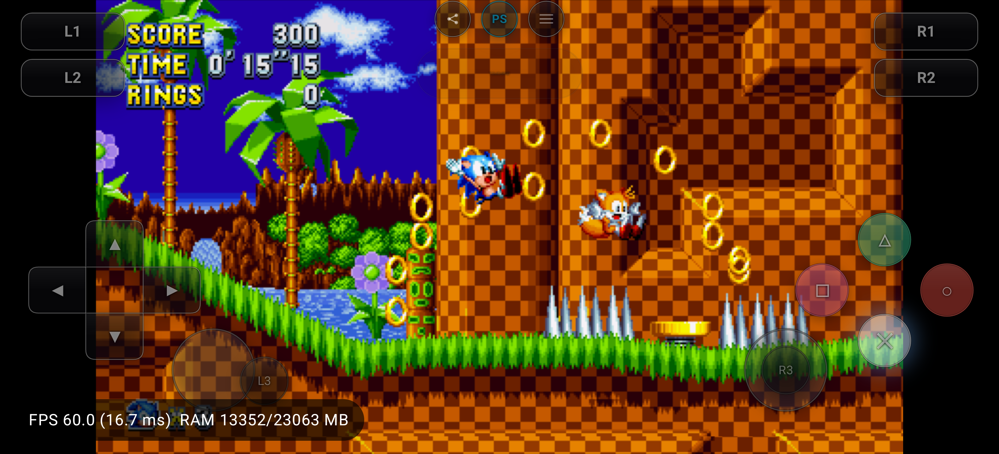
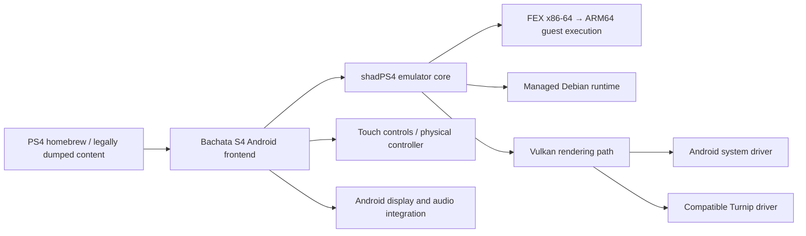

<!--
SPDX-FileCopyrightText: 2026 shadPS4 Emulator Project
SPDX-License-Identifier: GPL-2.0-or-later
-->

  

# Bachata S4

### Explore PlayStation 4 emulation on Android.

**An experimental, open-source PS4 emulator for ARM64 Android devices — powered by shadPS4, FEX and Vulkan, with transparent device-specific compatibility results.**

 

 

 

[**Get the supported Google Play build**](https://play.google.com/store/apps/details?id=com.bachatas4.android)
&nbsp;&nbsp;•&nbsp;&nbsp;
[**Check game compatibility**](https://jica98.github.io/Bachata-S4/#games)
&nbsp;&nbsp;•&nbsp;&nbsp;
[**View releases**](https://github.com/JICA98/Bachata-S4/releases)
&nbsp;&nbsp;•&nbsp;&nbsp;
[**Report an issue**](https://github.com/JICA98/Bachata-S4/issues)

> [!IMPORTANT]
> Bachata S4 is in **early experimental development**. Compatibility and performance vary by game, emulator release, phone, Android version and graphics driver. No games, firmware, keys or copyrighted system files are included.

---

## Why Bachata S4?

| | |
|---|---|
| **Built for Android** | A dedicated mobile frontend with game-library management, touch controls, controller support and Android-focused runtime integration. |
| **FEX guest execution** | Translates the emulator's x86-64 workload for modern ARM64 Android hardware. |
| **Vulkan graphics** | Supports Android Vulkan rendering with selectable system or compatible Turnip driver paths. |
| **Evidence-backed compatibility** | Reports are tied to an emulator release, commit, device, GPU, driver, screenshots, logs and measured performance. |

Bachata S4 is based on the excellent [shadPS4](https://github.com/shadps4-emu/shadPS4) project and adapts its desktop-oriented emulator core for ARM64 Android devices through a managed runtime and Android integration layer.

---

## See it running

  
  

### Published compatibility highlight

| Game | Status | Tested build | Device | Backend | Result |
|---|---|---|---|---|---|
| **Sonic Mania 01.03** | **In-game** | `v0.1.6` | OnePlus 13 · Snapdragon 8 Elite | FEX + Mesa Turnip | **59.83 FPS average** during the recorded test |

The result above is a **specific test report**, not a promise that every device or every part of the game will behave identically. Open the [live compatibility database](https://jica98.github.io/Bachata-S4/#games) for screenshots, driver details, logs and the newest results.

---

## Download

### Google Play — recommended

The Google Play build is the easiest supported way to install Bachata S4. Installing it from Play also directly supports continued emulator development, device testing and game-compatibility work.

### GitHub Releases — open-source builds

Release APKs, checksums and source-linked build artifacts are available from [GitHub Releases](https://github.com/JICA98/Bachata-S4/releases).

> [!NOTE]
> The download badge at the top counts **GitHub release assets only**. Google Play install totals are not included in that number.

---

## Compatibility

Compatibility is tracked as structured JSON in [`compatibility-site/data/games.json`](compatibility-site/data/games.json) and published automatically to the [Bachata S4 compatibility website](https://jica98.github.io/Bachata-S4/#games).

Each test can record:

- Emulator release and exact commit
- Game version and serial
- Phone, SoC, GPU, RAM and Android version
- Guest backend and graphics driver
- Resolution scale, FPS and frame pacing
- Screenshots, compressed logs and tester notes

<!-- compatibility-status-table -->
| Status | Reports |
|---|---:|
| `playable` | 0 |
| `ingame` | 1 |
| `menus` | 0 |
| `boots` | 0 |
| `nothing` | 0 |
<!-- compatibility-status-table -->

### Status meanings

| Status | Meaning |
|---|---|
| **Playable** | Suitable for normal play with no major blocker found in the tested session. |
| **In-game** | Reaches controllable gameplay, but completion or full stability is not verified. |
| **Menus** | Reaches menus or title screens but not controllable gameplay. |
| **Boots** | Starts and produces meaningful output before an early blocker. |
| **Nothing** | Does not reach useful output in the tested configuration. |

Compatibility is **release-specific and device-specific**. Always compare the report's emulator version, phone and selected driver with your own setup.

---

## How it works

The current compatibility pipeline records the active guest backend and graphics driver for every submitted result, so performance claims remain attached to the exact configuration that produced them.

---

## Features

- PS4 emulation frontend designed for **ARM64 Android**
- **FEX-based** guest execution for x86-64 workloads
- shadPS4 emulator core with Android runtime integration
- Vulkan rendering through supported device or Turnip drivers
- Game library with cover artwork and metadata
- Touch controls and physical-controller mapping
- Per-game configuration and driver selection
- Session logs and diagnostics for compatibility testing
- Release-linked public compatibility database
- Screenshot- and log-backed test reports
- Google Play and source-built distribution paths
- Open-source code under GPL-2.0-or-later

---

## Requirements

| Item | Requirement |
|---|---|
| **Operating system** | Android 12 or newer |
| **CPU architecture** | `arm64-v8a` |
| **Graphics** | Vulkan-capable GPU and driver |
| **Recommended hardware** | Recent high-end Snapdragon/Adreno device |
| **Storage** | Enough space for the app, runtime and user-provided content |
| **Content** | User-owned homebrew or legally dumped software only |

> [!TIP]
> Before buying or troubleshooting, check the [compatibility website](https://jica98.github.io/Bachata-S4/#games). A result from the same SoC and driver family is much more useful than a result from an unrelated phone.

---

## Quick start

1. Install Bachata S4 from [Google Play](https://play.google.com/store/apps/details?id=com.bachatas4.android).
2. Open the app and complete the initial runtime setup.
3. Select the appropriate graphics driver for your device.
4. Import your own legal homebrew or game dump.
5. Launch the title and allow initial shader or pipeline compilation to finish.
6. Compare your result with the [compatibility database](https://jica98.github.io/Bachata-S4/#games).
7. When reporting a problem, include the emulator version, device, driver and session log.

Bachata S4 does **not** provide games, firmware, licenses, decryption keys or copyrighted console files.

---

## App screenshots

  
  
  
  

<strong>Show more screenshots</strong>

 

  
  
  
  

---

## Project status

Bachata S4 is not a finished, universal PS4 emulator. Some titles may:

- Fail before rendering
- Reach only menus or gameplay
- Have missing graphics, audio or input
- Run slowly on current mobile hardware
- Behave differently across Android versions and GPU drivers
- Regress or improve between releases

Public testing is part of development. Every high-quality compatibility report helps identify whether a blocker belongs to CPU translation, kernel/HLE behavior, graphics, audio, input or Android integration.

---

## Build from source

The Android frontend lives in [`android/BachataS4`](android/BachataS4). Runtime inputs and revisions are pinned under [`runtime/locks`](runtime/locks).

Start with the maintained build guide:

- **[Android runtime and APK build instructions](documents/android-building.md)**
- [Contributing guide](CONTRIBUTING.md)
- [Runtime third-party notices](NOTICE.android-runtime.md)

The runtime and Android build paths are evolving quickly. Use the commands and toolchain versions in the build guide rather than copying instructions from older releases or third-party posts.

---

## Help improve compatibility

### Test a game

Use the repository skill at [`.agents/skills/bachata-compatibility/SKILL.md`](.agents/skills/bachata-compatibility/SKILL.md) to launch a title, capture evidence and create a structured compatibility entry.

A useful report should include:

1. Official Bachata S4 release tag
2. Exact phone model, SoC, GPU and Android version
3. Selected graphics driver and version
4. Game serial and update version
5. Clear status and reproduction notes
6. At least one screenshot when visual output is available
7. Sanitized application and emulator logs
8. FPS measurements only when the sampling method is recorded

### Report a bug

Search [existing issues](https://github.com/JICA98/Bachata-S4/issues) before opening a new one. Reports with exact reproduction steps, logs and device information are far more actionable than “game does not work.”

### Contribute code

Pull requests are welcome for Android integration, runtime packaging, compatibility fixes, diagnostics, documentation and test automation. Core emulator changes may also be relevant to [upstream shadPS4](https://github.com/shadps4-emu/shadPS4).

---

## FAQ

<strong>Does Bachata S4 include PS4 games?</strong>

 
No. Bachata S4 includes no games or copyrighted console content. You must provide content you legally own or open-source homebrew.

<strong>Will every PS4 game run?</strong>

 
No. The project is experimental and compatibility is currently limited. Check the live database before assuming a title works.

<strong>Why can the same game behave differently on two phones?</strong>

 
CPU generation, GPU, Android version, available memory, graphics driver and thermal limits can all change the result. This is why every compatibility entry records the full test environment.

<strong>Which devices are recommended?</strong>

 
Modern flagship Snapdragon devices with Adreno GPUs currently provide the most practical testing environment. This is a recommendation, not a guarantee of compatibility.

<strong>Where should I download Bachata S4?</strong>

 
Google Play is the recommended supported installation. GitHub Releases provide source-linked project builds and checksums.

---

## Legal

Bachata S4 is an independent open-source project and is not affiliated with, endorsed by or sponsored by Sony Interactive Entertainment.

“PlayStation” and related marks are trademarks of their respective owners. Bachata S4 does not circumvent the requirement to obtain software legally and does not distribute games, firmware, keys or copyrighted system components.

Use only software and content you have the legal right to run.

---

## Credits

- [shadPS4](https://github.com/shadps4-emu/shadPS4) developers and contributors — emulator core
- [FEX-Emu](https://github.com/FEX-Emu/FEX) developers and contributors — x86-64 guest execution
- Runtime, graphics and Android open-source projects listed in [NOTICE.android-runtime.md](NOTICE.android-runtime.md)
- Everyone submitting reproducible compatibility reports, logs and fixes

---

## License

Bachata S4 is licensed under **[GPL-2.0-or-later](LICENSE)**. Third-party runtime components retain their respective licenses.

---

### Help push PS4 emulation on Android forward.

**Install it. Test responsibly. Share evidence. Improve compatibility.**

